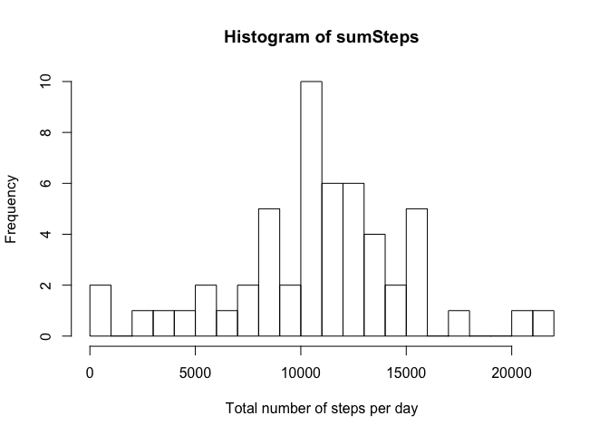
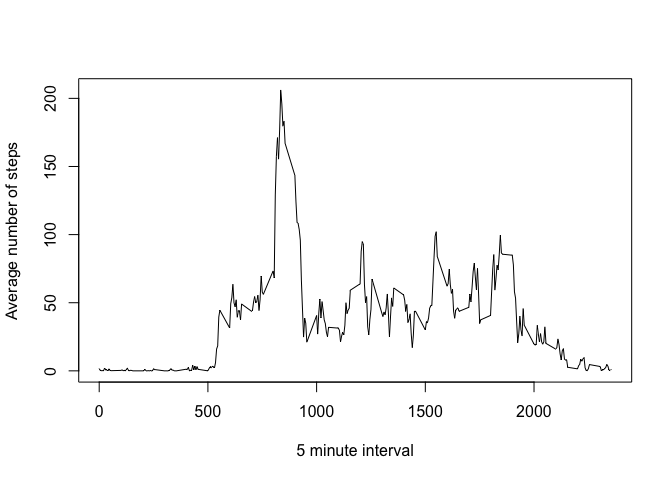

# Reproducible Research: Peer Assessment 1


## Loading and preprocessing the data

```r
unzip("activity.zip")
data <- read.csv("activity.csv")
data$interval <- as.factor(data$interval)
```
## What is mean total number of steps taken per day?

```r
dataCom <- data[complete.cases(data),]
sumSteps <- tapply(dataCom$steps, dataCom$date, sum)
sumSteps
```

```
## 2012-10-01 2012-10-02 2012-10-03 2012-10-04 2012-10-05 2012-10-06 
##         NA        126      11352      12116      13294      15420 
## 2012-10-07 2012-10-08 2012-10-09 2012-10-10 2012-10-11 2012-10-12 
##      11015         NA      12811       9900      10304      17382 
## 2012-10-13 2012-10-14 2012-10-15 2012-10-16 2012-10-17 2012-10-18 
##      12426      15098      10139      15084      13452      10056 
## 2012-10-19 2012-10-20 2012-10-21 2012-10-22 2012-10-23 2012-10-24 
##      11829      10395       8821      13460       8918       8355 
## 2012-10-25 2012-10-26 2012-10-27 2012-10-28 2012-10-29 2012-10-30 
##       2492       6778      10119      11458       5018       9819 
## 2012-10-31 2012-11-01 2012-11-02 2012-11-03 2012-11-04 2012-11-05 
##      15414         NA      10600      10571         NA      10439 
## 2012-11-06 2012-11-07 2012-11-08 2012-11-09 2012-11-10 2012-11-11 
##       8334      12883       3219         NA         NA      12608 
## 2012-11-12 2012-11-13 2012-11-14 2012-11-15 2012-11-16 2012-11-17 
##      10765       7336         NA         41       5441      14339 
## 2012-11-18 2012-11-19 2012-11-20 2012-11-21 2012-11-22 2012-11-23 
##      15110       8841       4472      12787      20427      21194 
## 2012-11-24 2012-11-25 2012-11-26 2012-11-27 2012-11-28 2012-11-29 
##      14478      11834      11162      13646      10183       7047 
## 2012-11-30 
##         NA
```

```r
hist(sumSteps, breaks = 20, xlab = "Total number of steps per day")
```

 

```r
mean(sumSteps, na.rm = TRUE)
```

```
## [1] 10766.19
```

```r
median(sumSteps, na.rm = TRUE)
```

```
## [1] 10765
```
## What is the average daily activity pattern?

```r
intMean <- tapply(data$steps, data$interval, mean, na.rm = TRUE)
intMean
```

```
##           0           5          10          15          20          25 
##   1.7169811   0.3396226   0.1320755   0.1509434   0.0754717   2.0943396 
##          30          35          40          45          50          55 
##   0.5283019   0.8679245   0.0000000   1.4716981   0.3018868   0.1320755 
##         100         105         110         115         120         125 
##   0.3207547   0.6792453   0.1509434   0.3396226   0.0000000   1.1132075 
##         130         135         140         145         150         155 
##   1.8301887   0.1698113   0.1698113   0.3773585   0.2641509   0.0000000 
##         200         205         210         215         220         225 
##   0.0000000   0.0000000   1.1320755   0.0000000   0.0000000   0.1320755 
##         230         235         240         245         250         255 
##   0.0000000   0.2264151   0.0000000   0.0000000   1.5471698   0.9433962 
##         300         305         310         315         320         325 
##   0.0000000   0.0000000   0.0000000   0.0000000   0.2075472   0.6226415 
##         330         335         340         345         350         355 
##   1.6226415   0.5849057   0.4905660   0.0754717   0.0000000   0.0000000 
##         400         405         410         415         420         425 
##   1.1886792   0.9433962   2.5660377   0.0000000   0.3396226   0.3584906 
##         430         435         440         445         450         455 
##   4.1132075   0.6603774   3.4905660   0.8301887   3.1132075   1.1132075 
##         500         505         510         515         520         525 
##   0.0000000   1.5660377   3.0000000   2.2452830   3.3207547   2.9622642 
##         530         535         540         545         550         555 
##   2.0943396   6.0566038  16.0188679  18.3396226  39.4528302  44.4905660 
##         600         605         610         615         620         625 
##  31.4905660  49.2641509  53.7735849  63.4528302  49.9622642  47.0754717 
##         630         635         640         645         650         655 
##  52.1509434  39.3396226  44.0188679  44.1698113  37.3584906  49.0377358 
##         700         705         710         715         720         725 
##  43.8113208  44.3773585  50.5094340  54.5094340  49.9245283  50.9811321 
##         730         735         740         745         750         755 
##  55.6792453  44.3207547  52.2641509  69.5471698  57.8490566  56.1509434 
##         800         805         810         815         820         825 
##  73.3773585  68.2075472 129.4339623 157.5283019 171.1509434 155.3962264 
##         830         835         840         845         850         855 
## 177.3018868 206.1698113 195.9245283 179.5660377 183.3962264 167.0188679 
##         900         905         910         915         920         925 
## 143.4528302 124.0377358 109.1132075 108.1132075 103.7169811  95.9622642 
##         930         935         940         945         950         955 
##  66.2075472  45.2264151  24.7924528  38.7547170  34.9811321  21.0566038 
##        1000        1005        1010        1015        1020        1025 
##  40.5660377  26.9811321  42.4150943  52.6603774  38.9245283  50.7924528 
##        1030        1035        1040        1045        1050        1055 
##  44.2830189  37.4150943  34.6981132  28.3396226  25.0943396  31.9433962 
##        1100        1105        1110        1115        1120        1125 
##  31.3584906  29.6792453  21.3207547  25.5471698  28.3773585  26.4716981 
##        1130        1135        1140        1145        1150        1155 
##  33.4339623  49.9811321  42.0377358  44.6037736  46.0377358  59.1886792 
##        1200        1205        1210        1215        1220        1225 
##  63.8679245  87.6981132  94.8490566  92.7735849  63.3962264  50.1698113 
##        1230        1235        1240        1245        1250        1255 
##  54.4716981  32.4150943  26.5283019  37.7358491  45.0566038  67.2830189 
##        1300        1305        1310        1315        1320        1325 
##  42.3396226  39.8867925  43.2641509  40.9811321  46.2452830  56.4339623 
##        1330        1335        1340        1345        1350        1355 
##  42.7547170  25.1320755  39.9622642  53.5471698  47.3207547  60.8113208 
##        1400        1405        1410        1415        1420        1425 
##  55.7547170  51.9622642  43.5849057  48.6981132  35.4716981  37.5471698 
##        1430        1435        1440        1445        1450        1455 
##  41.8490566  27.5094340  17.1132075  26.0754717  43.6226415  43.7735849 
##        1500        1505        1510        1515        1520        1525 
##  30.0188679  36.0754717  35.4905660  38.8490566  45.9622642  47.7547170 
##        1530        1535        1540        1545        1550        1555 
##  48.1320755  65.3207547  82.9056604  98.6603774 102.1132075  83.9622642 
##        1600        1605        1610        1615        1620        1625 
##  62.1320755  64.1320755  74.5471698  63.1698113  56.9056604  59.7735849 
##        1630        1635        1640        1645        1650        1655 
##  43.8679245  38.5660377  44.6603774  45.4528302  46.2075472  43.6792453 
##        1700        1705        1710        1715        1720        1725 
##  46.6226415  56.3018868  50.7169811  61.2264151  72.7169811  78.9433962 
##        1730        1735        1740        1745        1750        1755 
##  68.9433962  59.6603774  75.0943396  56.5094340  34.7735849  37.4528302 
##        1800        1805        1810        1815        1820        1825 
##  40.6792453  58.0188679  74.6981132  85.3207547  59.2641509  67.7735849 
##        1830        1835        1840        1845        1850        1855 
##  77.6981132  74.2452830  85.3396226  99.4528302  86.5849057  85.6037736 
##        1900        1905        1910        1915        1920        1925 
##  84.8679245  77.8301887  58.0377358  53.3584906  36.3207547  20.7169811 
##        1930        1935        1940        1945        1950        1955 
##  27.3962264  40.0188679  30.2075472  25.5471698  45.6603774  33.5283019 
##        2000        2005        2010        2015        2020        2025 
##  19.6226415  19.0188679  19.3396226  33.3396226  26.8113208  21.1698113 
##        2030        2035        2040        2045        2050        2055 
##  27.3018868  21.3396226  19.5471698  21.3207547  32.3018868  20.1509434 
##        2100        2105        2110        2115        2120        2125 
##  15.9433962  17.2264151  23.4528302  19.2452830  12.4528302   8.0188679 
##        2130        2135        2140        2145        2150        2155 
##  14.6603774  16.3018868   8.6792453   7.7924528   8.1320755   2.6226415 
##        2200        2205        2210        2215        2220        2225 
##   1.4528302   3.6792453   4.8113208   8.5094340   7.0754717   8.6981132 
##        2230        2235        2240        2245        2250        2255 
##   9.7547170   2.2075472   0.3207547   0.1132075   1.6037736   4.6037736 
##        2300        2305        2310        2315        2320        2325 
##   3.3018868   2.8490566   0.0000000   0.8301887   0.9622642   1.5849057 
##        2330        2335        2340        2345        2350        2355 
##   2.6037736   4.6981132   3.3018868   0.6415094   0.2264151   1.0754717
```

```r
plot(levels(data$interval), intMean, type = "l", xlab = "5 minute interval", ylab = "Average number of steps")
```

 

```r
which.max(intMean)
```

```
## 835 
## 104
```

## Imputing missing values

```r
sum(is.na(data))
```

```
## [1] 2304
```
## Are there differences in activity patterns between weekdays and weekends?

